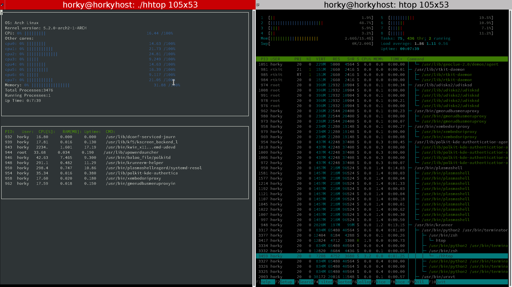

# CppND-System-Monitor

Starter code for System Monitor Project in the C++ OOP course. Most of the code is provided for you here. Follow along with the classroom lesson to fill out the `ProcessParser` and `Process` classes to complete your project!

## To setup and compile in Udacity Ubuntu workspace:

1. Clone repository into `/home/workspace/`

```bash
cd /home/workspace/
git clone https://github.com/Horki/CppND-System-Monitor
```

2. Follow along with the lesson and make sure you complete the `ProcessParser` and `Process` classes before attempting to run the project.

3. Install `ncurses` package, this is not needed, we do this trough conan package manager.

```bash
# Ubuntu
sudo apt-get install libncurses5-dev libncursesw5-dev
# Arch
sudo pacman -S ncurses
```

4. Compile and run
- Make a build directory with `mkdir build`.
- Change into the build directory, `cd build`.
- Build with conan `conan install .. --build missing -s compiler.libcxx=libstdc++11`.
- Compile the project, `cmake .. && make`.
- Run the project `./bin/hhtop`.

5. In case of error that looks like the following:

```bash
root@77e30fca8a01:/home/workspace/CppND-Object-Oriented# ./hhtop
*** %n in writable segment detected ***
                                      Aborted (core dumped)
```

just keep trying `./hhtop` and it should work eventually!

Running System Monitor example

